# HomeLab using Linux Users, Groups, and Permissions

This lab shows how I used basic Linux commands to manage users, groups, and file permissions in my Ubuntu VM.

---

## 1. List available updates  
**Command**:  
```bash
apt list --upgradable
```  
This lists all packages on my system that have updates. It tells me what software is out of date.  
(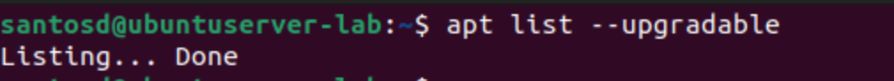)

---

## 2. Update and upgrade  
**Command**:  
```bash
sudo apt update
sudo apt upgrade -y
```  
`apt update` refreshes the package list, and `apt upgrade` installs the newest versions. This keeps the system secure.  
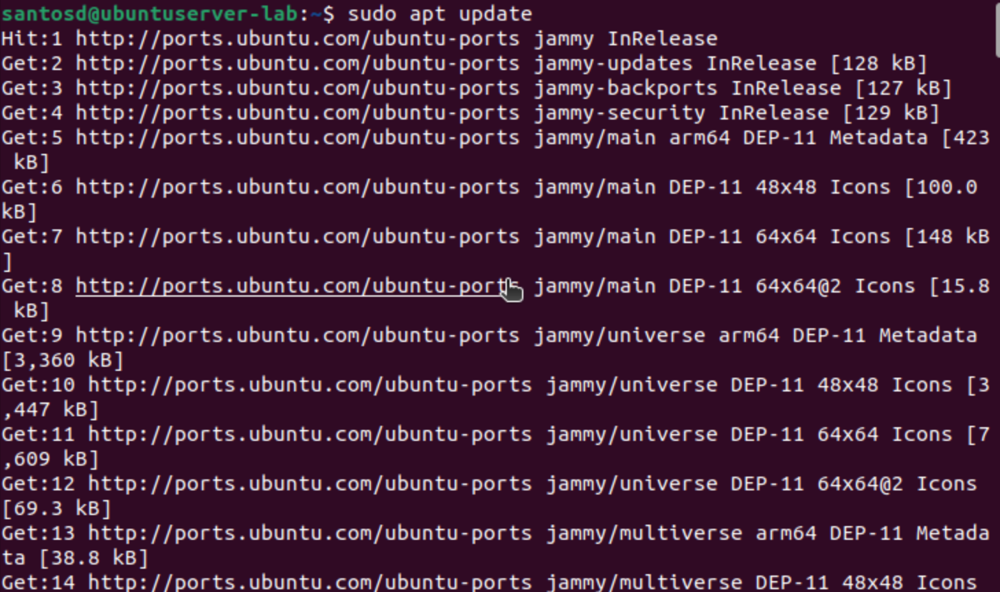
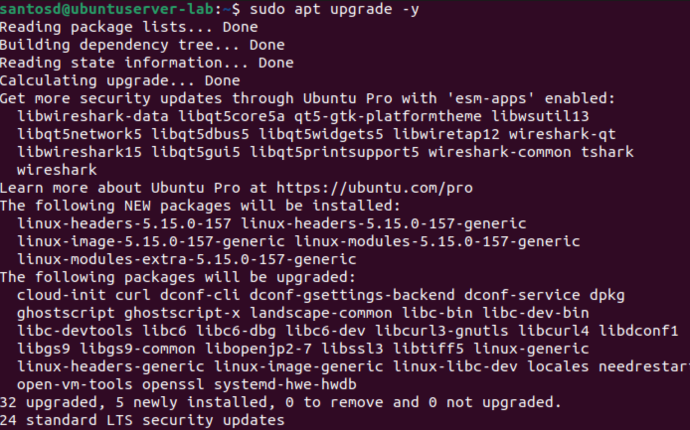
---

## 3. Reboot  
**Command**:  
```bash
sudo reboot
```  
Reboots the machine so kernel and service updates are applied.  
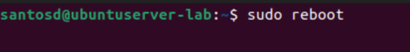

---

## 4. Become root  
**Command**:  
```bash
sudo su
```  
Switches me to the root user. The prompt changes to `#` which means I can run anything, but it’s risky if I make a mistake.  
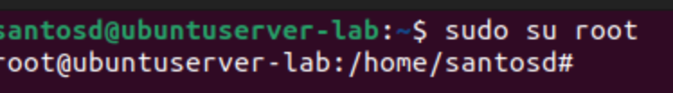
---

## 5. Create users  
**Commands**:  
```bash
sudo useradd bobby
sudo adduser sally
```  
`useradd` just makes the account quickly. `adduser` is interactive it asks me to set a password and home directory.  
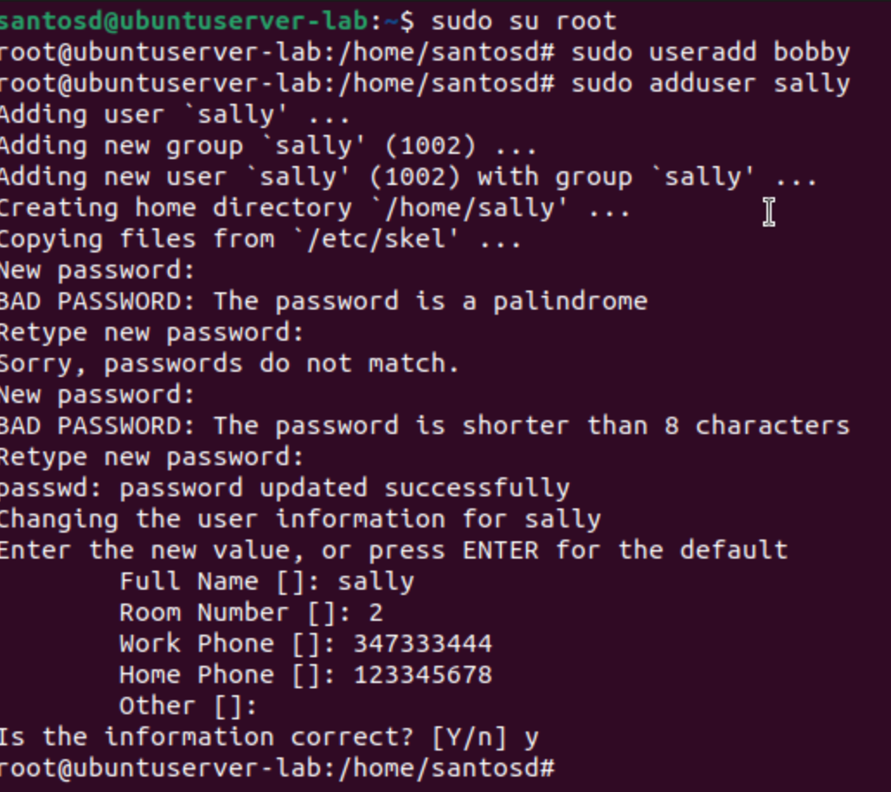
---

## 6. Switch to new user  
**Command**:  
```bash
su - sally
```  
Changes my shell to log in as sally. This lets me test that her account works.  
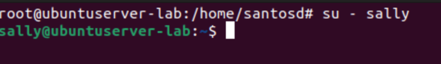
---

## 7. Try to add user as sally  
**Commands**:  
```bash
sudo adduser earl
adduser earl
```  
Both fail because sally doesn’t have admin rights. This shows regular users can’t create accounts.  
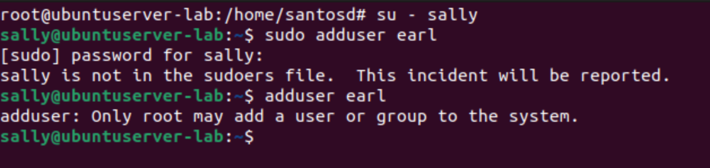
---

## 8. Delete user  
**Commands**:  
```bash
exit
sudo deluser --remove-home earl
# or
sudo userdel -r earl
```  
Removes the user earl. This is good practice to clean up accounts I don’t need.  
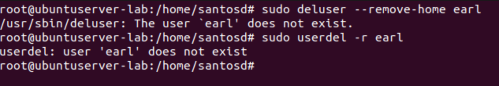
---

## 9. Change password  
**Command**:  
```bash
sudo passwd sally
```  
Lets me reset sally’s password.  
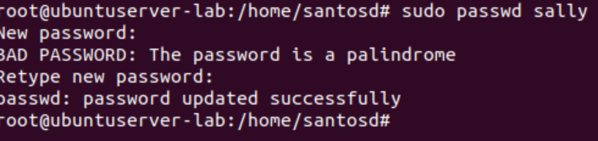
---

## 10. Why not stay root?  
Being root gives me full control, but one wrong command can break the system. It’s safer to stay a normal user and only use `sudo` when I need it.  
 

---

## 11. Show user ID  
**Commands**:  
```bash
id
id -u
```  
`id` shows my user ID, group ID, and groups. `id -u` just prints my numeric user ID.  
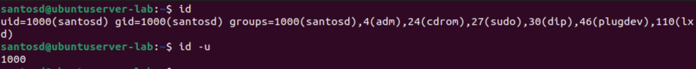
---

## 12. Show ubuntu’s groups  
**Command**:  
```bash
whoami
groups (whoami)
```  
Lists all the groups the ubuntu user belongs to. Groups control what resources I can access.  
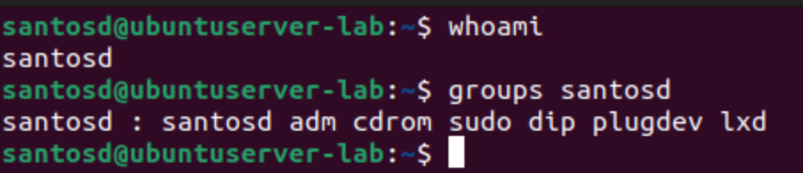
---

## 13. Give sally sudo  
**Commands**:  
```bash
sudo usermod -aG sudo sally
su - sally
sudo adduser testuser
sudo deluser --remove-home testuser
```  
`usermod` adds sally to the sudo group. Then I log in as sally to test her new admin rights by creating and deleting a test account.  
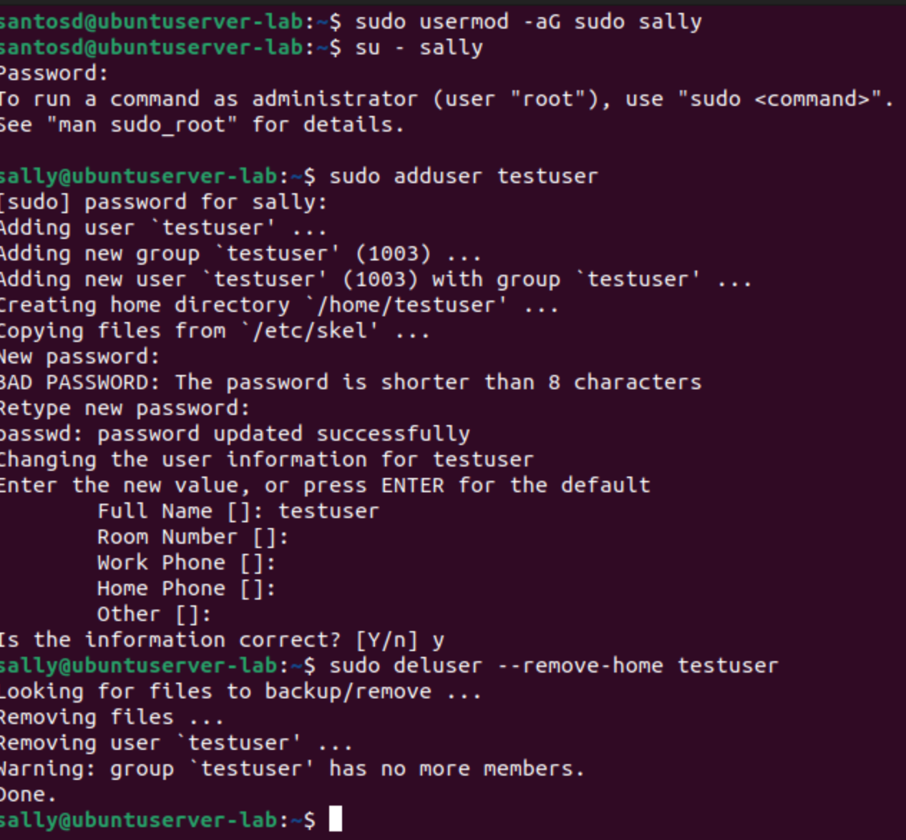

---

## 14. Create new group  
**Command**:  
```bash
sudo groupadd cybersec
```  
Makes a new group named cybersec. Groups are a way to organize permissions.  
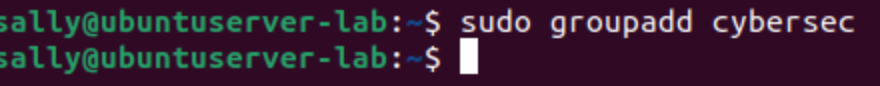

---

## 15. Add user to group  
**Command**:  
```bash
sudo usermod -aG cybersec sally
```  
Adds sally to the cybersec group.  
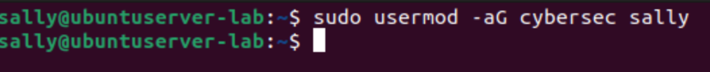


---

## 16. Check sally’s groups  
**Command**:  
```bash
groups sally
```  
Shows that sally is now a member of cyberse.  
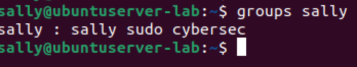

---

## 17. Create lab1 and check permissions  
**Commands**:  
```bash
mkdir lab1
ls -ld lab1
```  
Makes a new directory and lists its permissions (who owns it and who can read/write/execute).  
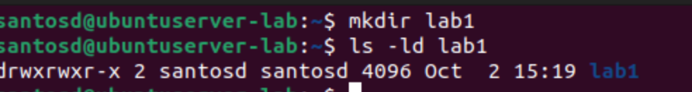

---nh

## 18. Create script and make it executable  
**Commands**:  
```bash
cd lab1
nano helloWorld.sh
 echo "Hello World!"
chmod +x helloWorld.sh
./helloWorld.sh
```  
I made a simple script and used `chmod` to make it executable. Then I ran it.  
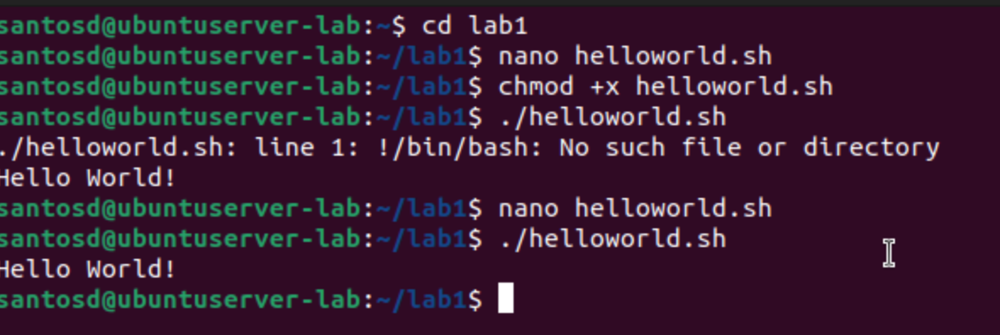
---

## 19. Inspect and adjust permissions  
**Commands**:  
```bash
ls -la helloWorld.sh
chmod g+wx helloWorld.sh
```  
`ls -la` shows file permissions. `chmod g+wx` gives the group write and execute permissions.  
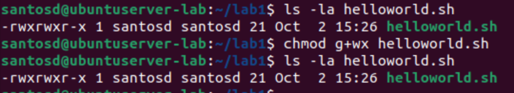
---

## 20. View ACL  
**Command**:  
```bash
getfacl helloWorld.sh
```  
Shows the Access Control List for the file. This gives more detailed permissions than just rwx.  
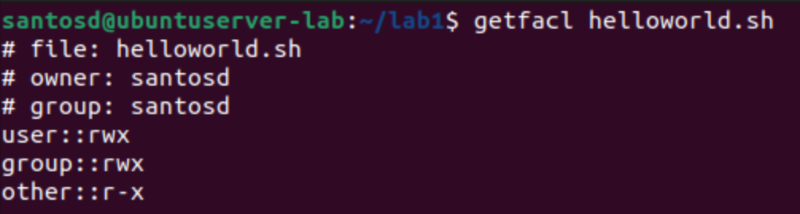
---

## 21. Add ACL for sally  
**Command**:  
```bash
setfacl -m u:sally:rw helloWorld.sh
```  
Gives sally explicit read and write rights to the script, even if the normal group permissions wouldn’t allow it.  
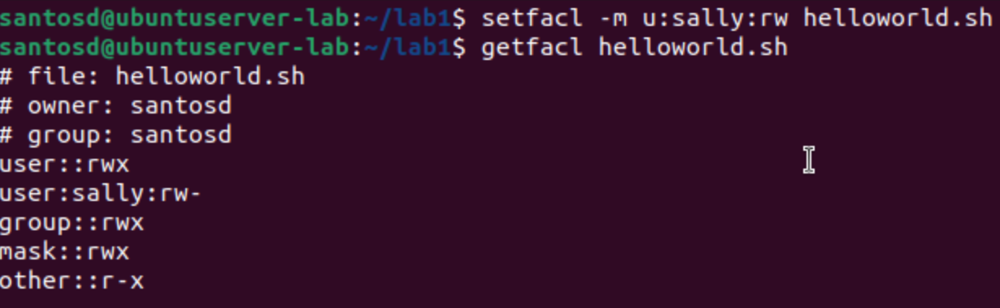