# Environment Variable and Set-UID Lab

This lab is based on the SEED Labs **Environment Variable and Set-UID Program Lab**. 
It demonstrates how environment variables affect program behavior, how they transfer between processes,  
and how Set-UID programs handle environment related security risks.

---

## Setup
```bash
sudo apt update && sudo apt upgrade -y
sudo apt install zsh -y
sudo apt-get install build-essential -y
mkdir -p ~/seed-labs/env-lab
cd ~/seed-labs/env-lab
````

**Explanation:**
These commands update the system, install required compilers (`build-essential`) and the `zsh` shell used later in the lab.

---

## Task 1 Manipulating Environment Variables

**Commands**

```bash
printenv
printenv PWD
export DEMO_VAR="hello_world"
printenv DEMO_VAR
unset DEMO_VAR
printenv DEMO_VAR
```

**Explanation:**
`printenv` shows environment variables, `export` adds one to the environment, and `unset` removes it.
They are built into Bash, not standalone executables.


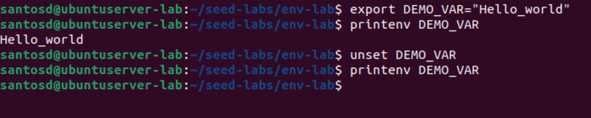
---

## Task 2 Passing Environment Variables (Parent → Child)

**File: `myprintenv.c`**

```c
#include <unistd.h>
#include <stdio.h>
#include <stdlib.h>
extern char **environ;
void printenv()
{
int i = 0;
while (environ[i] != NULL) {
printf("%s\n", environ[i]);
i++;
}
}
void main()
{
pid_t childPid;
switch(childPid = fork()) {
case 0: /* child process */
printenv(); ➀
exit(0);
default: /* parent process */
//printenv();  
```

**Build & Run**

```bash
gcc -o myprintenv myprintenv.c
./myprintenv > child_env.txt
# Edit program to print parent env
gcc -o myprintenv myprintenv.c
./myprintenv > parent_env.txt
diff -u parent_env.txt child_env.txt
```

**Explanation:**
The child process inherits a copy of its parent’s environment.
The `diff -s` output shows nearly identical contents except for process specific entries like `PID`, there is no output after 'diff -u' due to parent_env and child_env being identical so run 'diff-s' to get an explicit message if you want confirmation.

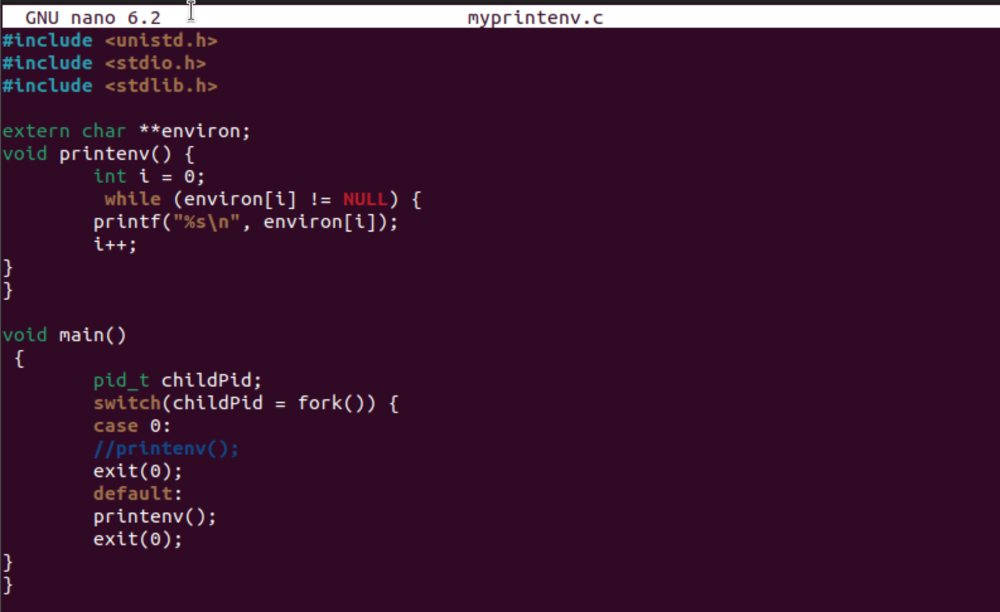
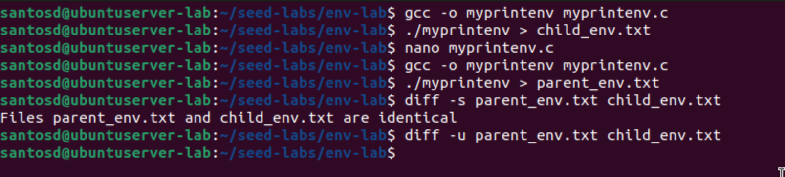
---

## Task 3 Environment Variables and `execve()`

**File: `myenv.c`**

```c
#include <unistd.h>
extern char **environ;
int main()
{
char *argv[2];
argv[0] = "/usr/bin/env";
argv[1] = NULL;
execve("/usr/bin/env", argv, NULL); ➀
return 0 ;
}
```

**Then change:**

```c
execve("/usr/bin/env", argv, environ);
```

**Explanation:**
When `NULL` is passed, the environment is empty so no output.
When `environ` is passed, the new process inherits the caller’s environment.

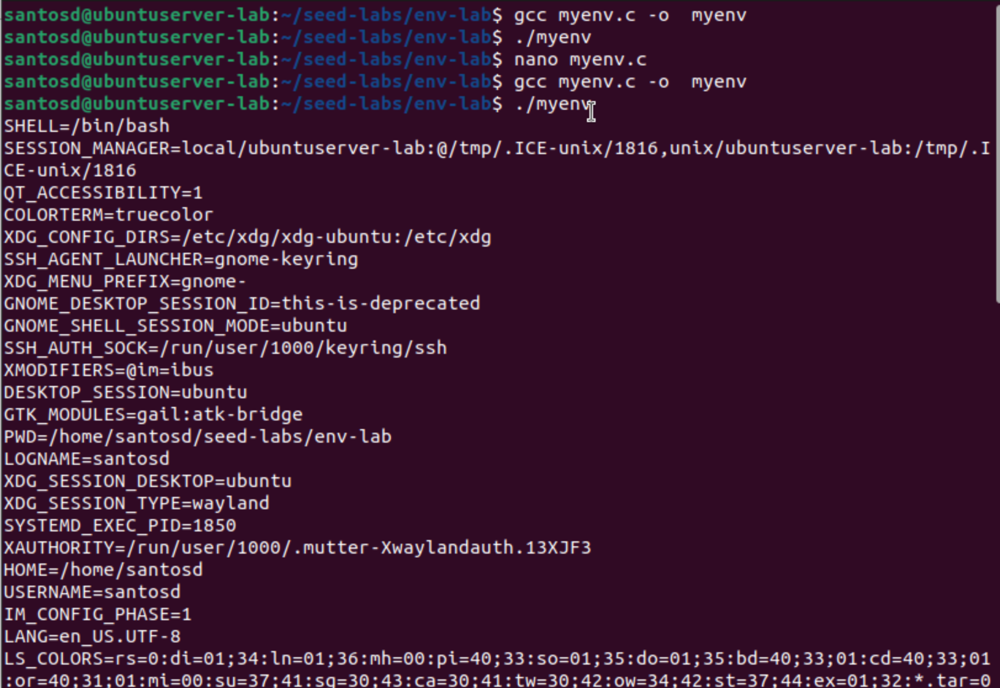

---

## Task 4  Environment Variables and `system()`

**File: `system_env.c`**

```c
#include <stdlib.h>
int main() {
    system("/usr/bin/env");
    return 0;
}
```

**Explanation:**
`system()` runs `/bin/sh -c <cmd>` using the caller’s environment, showing inherited variables.
Unlike `execve()`, it always uses a shell wrapper.

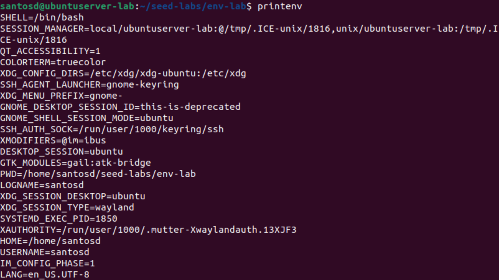


---

## Task 5  Environment Variables and Set-UID Programs

**File: `foo.c`**

```c
#include <stdio.h>
#include <stdlib.h>
extern char **environ;
int main()
{
int i = 0;
while (environ[i] != NULL) {
printf("%s\n", environ[i]);
i++;
}
}
```

**Commands**

```bash
gcc -o foo foo.c
sudo chown root:root foo
sudo chmod 4755 foo
export PATH="/home/seed/bin:$PATH"
export LD_LIBRARY_PATH="/tmp/mylibs"
export MYVAR="demo"
./foo > suid_env.txt
```

**Explanation:**
Normal environment variables are inherited, but unsafe ones (`LD_*`) are stripped to prevent library injection in SUID programs.

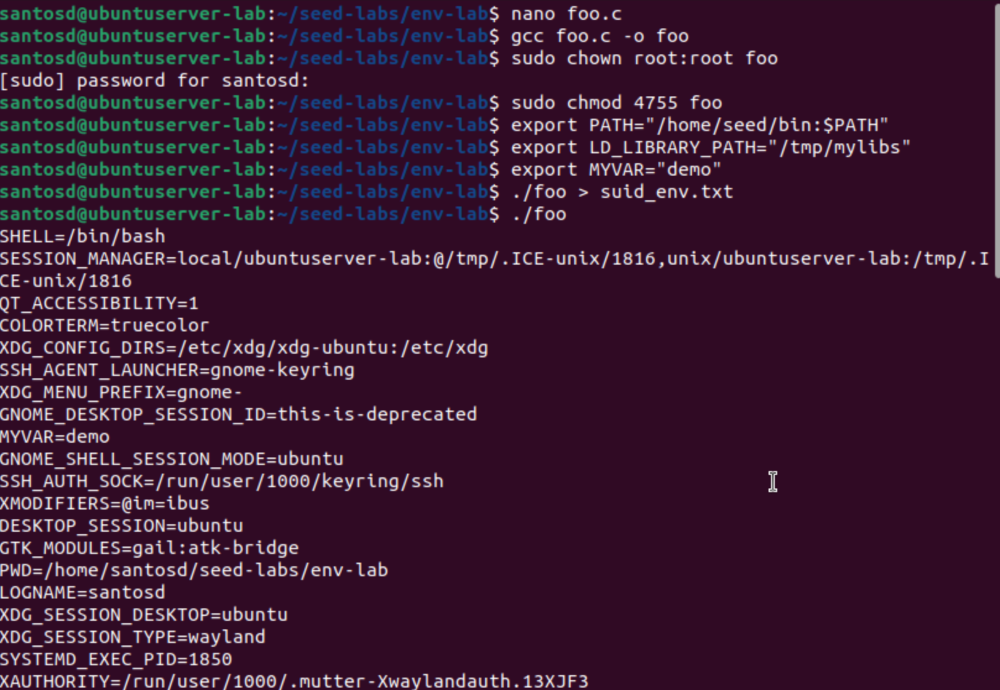

---

## Task 6  PATH Hijacking with SUID and `system()`

**File: `suid_ls.c`**

```c
#include <stdlib.h>
int main() { system("ls"); return 0; }
```

**Commands**

```bash
gcc -o suid_ls suid_ls.c
sudo chown root:root suid_ls
sudo chmod 4755 suid_ls

mkdir -p ~/bin
echo '#!/bin/sh' > ~/bin/ls
echo 'echo "PWNED as $(id)"' >> ~/bin/ls
chmod +x ~/bin/ls
export PATH="$HOME/bin:$PATH"
./suid_ls
```

**Explanation:**
`system("ls")` relies on `$PATH`.
If a malicious `ls` exists earlier in `$PATH`, it may run instead.
Modern shells mitigate this by dropping privileges.

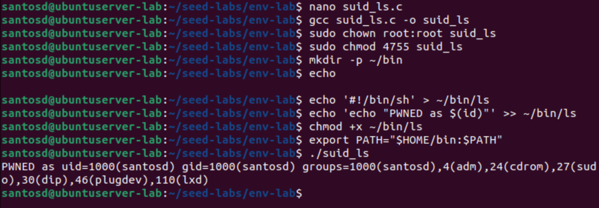

---

## Task 7  `LD_PRELOAD` and SUID

**File: `mylib.c`**

```c
#include <stdio.h>
void sleep (int s)
{
/* If this is invoked by a privileged program,
you can do damages here! */
printf("I am not sleeping!\n");
}
```

**Commands**

```bash
gcc -fPIC -c mylib.c
gcc -shared -o libmylib.so.1.0.1 mylib.o -lc
export LD_PRELOAD="$PWD/libmylib.so.1.0.1"
cat > myprog.c <<'EOF'
#include <unistd.h>
int main(){ sleep(1); return 0; }
EOF
gcc -o myprog myprog.c
./myprog
sudo chown root:root myprog
sudo chmod 4755 myprog
./myprog
```

**Explanation:**
`LD_PRELOAD` overrides library functions in normal programs.
SUID executables ignore `LD_PRELOAD` for safety, preventing injected libraries.

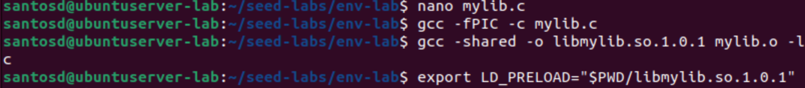
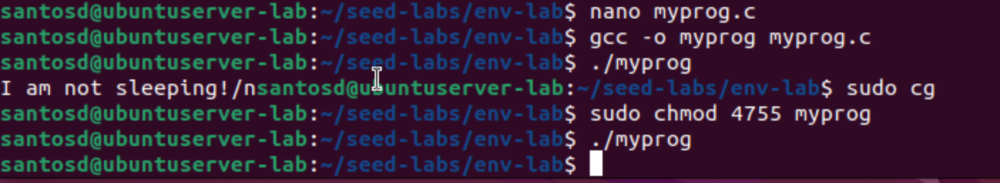

---

## Task 8 `system()` vs `execve()` in SUID

**File: `catall.c`**

```c
int main(int argc, char *argv[])
{
char *v[3];
char *command;
if(argc < 2) {
printf("Please type a file name.\n");
return 1;
}
v[0] = "/bin/cat"; v[1] = argv[1]; v[2] = NULL;
command = malloc(strlen(v[0]) + strlen(v[1]) + 2);
sprintf(command, "%s %s", v[0], v[1]);
// Use only one of the followings.
system(command);
// execve(v[0], v, NULL);
```

**Explanation:**
The 'catall_system' Set-UID binary demonstrated a shell-injection risk: passing 'dummy.txt; rm -f /etc/test_protected_file; echo INJECTED' produced the INJECTED output, showing system() invoked a shell and metacharacters were executed; replacing system() with execve("/bin/cat", v, NULL) prevented the injection and left the protected file intact, proving execve() is safe from this class of shell parsing attacks

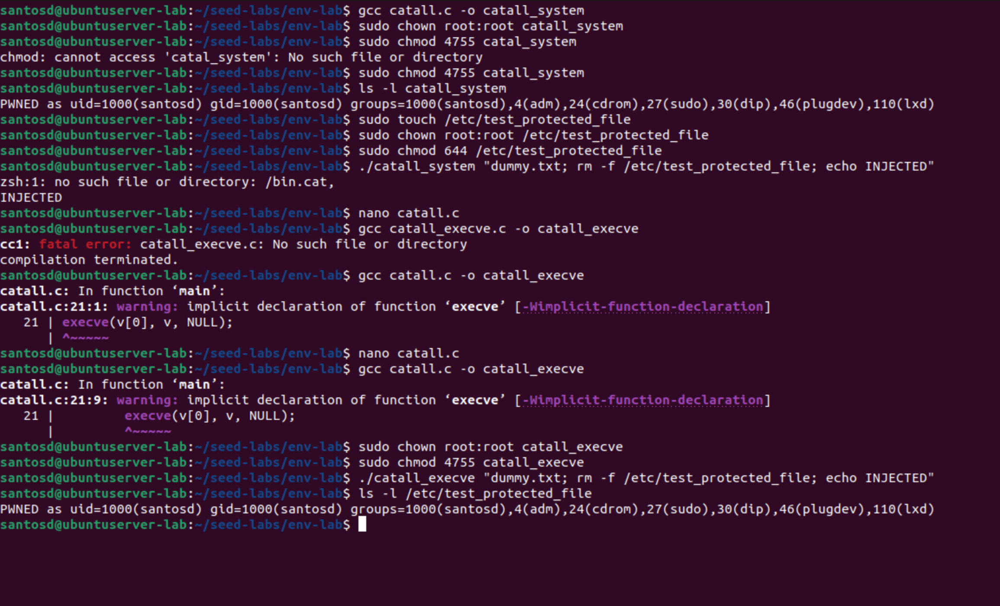

---

## Task 9 Capability Leaking

**File: `cap_leak.c`**

```c
#include <stdio.h>
#include <stdlib.h>
#include <fcntl.h>
#include <unistd.h>

void main()
{
int fd;
char *v[2];
/* Assume that /etc/zzz is an important system file,
* and it is owned by root with permission 0644.
* Before running this program, you should create
* the file /etc/zzz first. */
fd = open("/etc/zzz", O_RDWR | O_APPEND);
if (fd == -1) {
printf("Cannot open /etc/zzz\n");
exit(0);
}
// Print out the file descriptor value
printf("fd is %d\n", fd);
// Permanently disable the privilege by making the
// effective uid the same as the real uid
setuid(getuid());
// Execute /bin/sh
v[0] = "/bin/sh"; v[1] = 0;
execve(v[0], v, 0);
}
```

**Explanation:**
The cap_leak Set-UID program opened /etc/zzz with root privileges and printed the open file descriptor number before calling setuid(getuid()) and executing a shell. Even though the privileges were dropped, the already-opened file descriptor remained valid and was inherited by the new shell. Using printf with the leaked fd successfully appended text to /etc/zzz, proving a capability-leaking vulnerability.

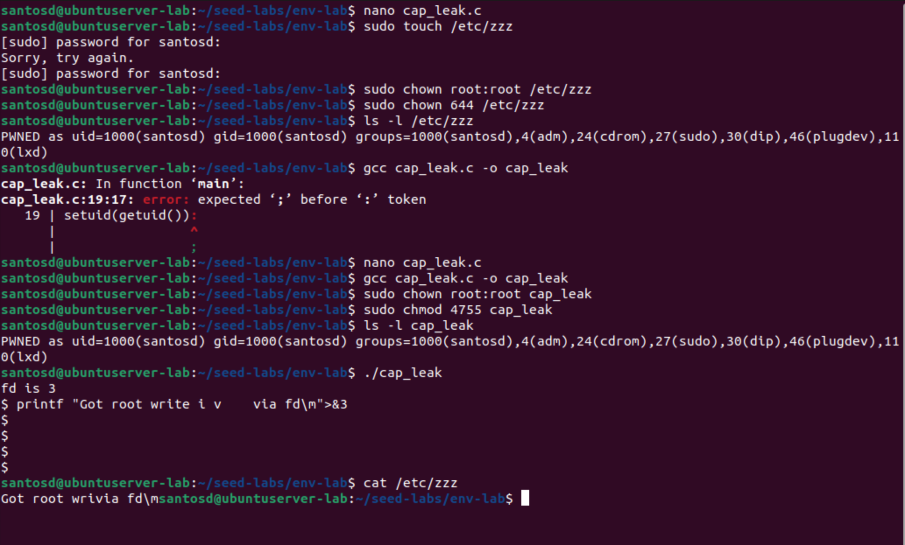
