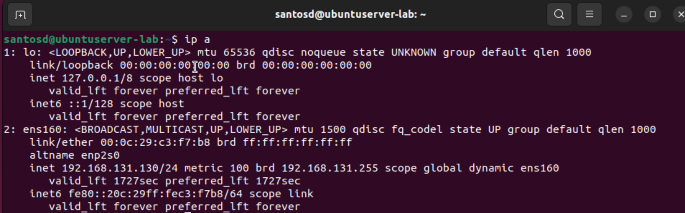
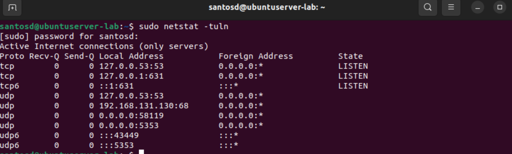
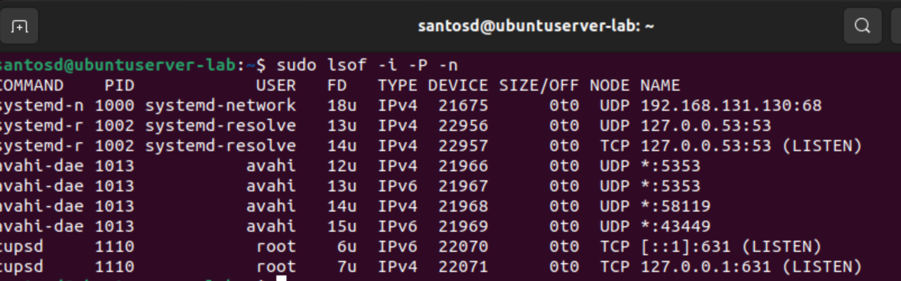
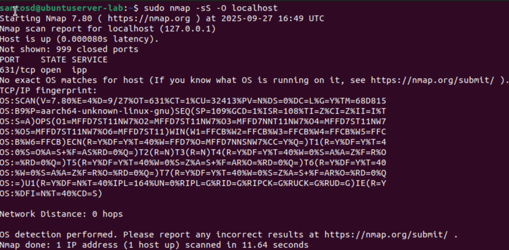
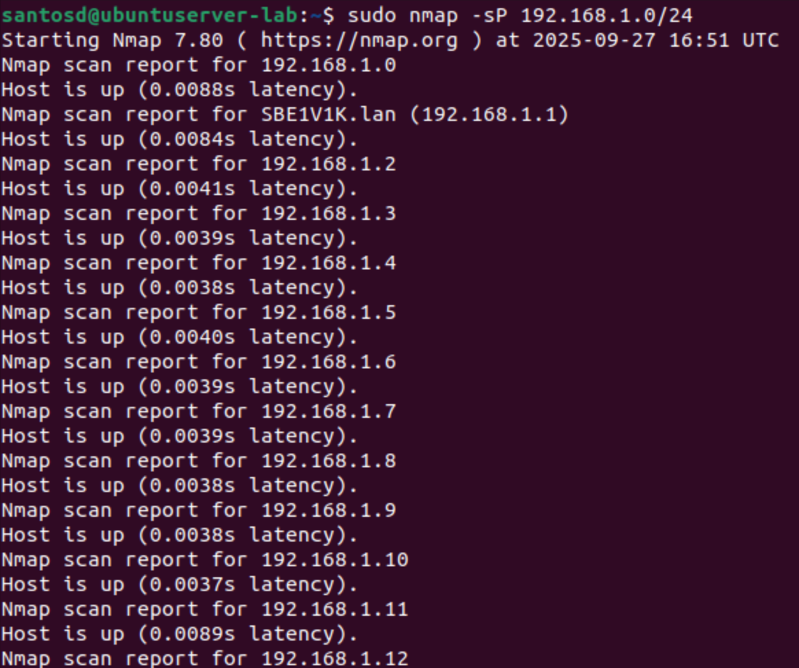
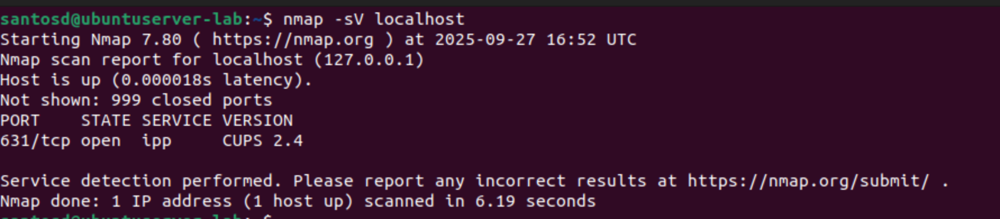
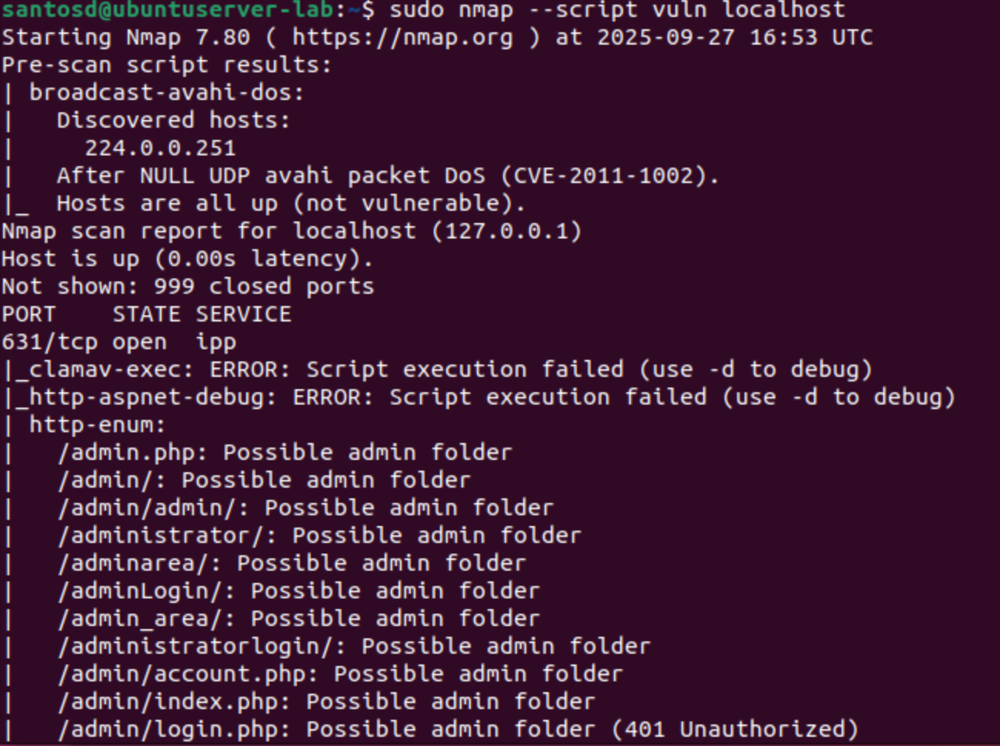
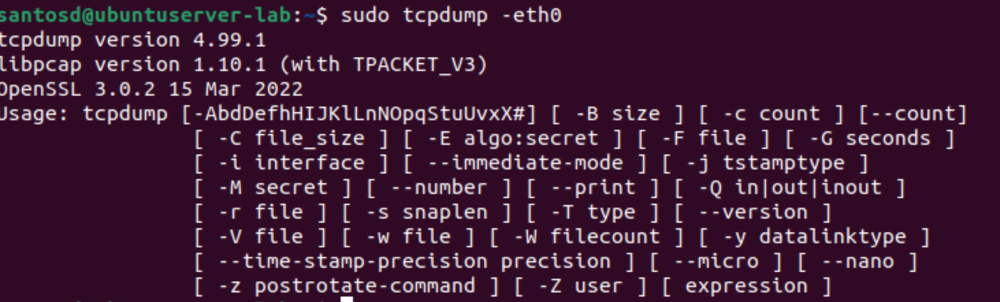
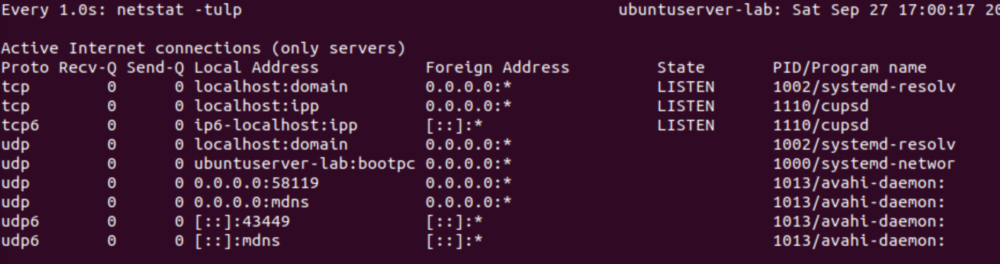
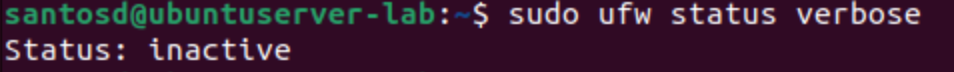

# Exploring Ubuntu Home Lab 

## 1. Interfaces and IP addresses
**Tool**: `ip` / `ifconfig`  
These commands show all network interfaces on the system and their IP addresses. This helps me know which network my machine is on and which interface is active. It is the starting point for all other network analysis.

---

## 2. Open listening ports
**Tool**: `ss` / `netstat`  
These tools list all the ports that are open and waiting for connections. Knowing which ports are listening is important because open ports can be potential entry points for attackers.

---

## 3. Map ports to processes
**Tool**: `lsof`  
This tool shows which process is using which port. It is useful to connect open ports to the exact program running, so I can verify if the traffic is expected or suspicious.

---

## 4. Localhost scan
**Tool**: `nmap -sS -O`  
Nmap can scan my own machine to confirm open ports and also try to guess the operating system. It helps me see what information an attacker might see when scanning my system.

---

## 5. Discover devices on the network
**Tool**: `nmap -sn`  
This runs a ping scan to find other devices on the same subnet. It is useful for mapping out the network and checking if there are any unknown or unauthorized devices.

---

## 6. Service and version detection
**Tool**: `nmap -sV`  
This mode goes deeper by identifying which service is running on each open port and what version it is. Old or outdated versions of services may have vulnerabilities, so this information is key for patching.

---

## 7. Vulnerability scan
**Tool**: `nmap --script vuln`  
This uses Nmap’s vulnerability scripts to check if known exploits apply to the services running on the system. It is not a full penetration test, but it gives quick leads on possible weaknesses.

---

## 8. Network traffic capture
**Tool**: `tcpdump`  
This tool captures live packets going through the network interface. It helps me see what kind of traffic is leaving or entering the machine and can reveal unusual or suspicious activity.

---

## 9. Real-time monitoring
**Tool**: `watch netstat` / `watch ss`  
This command reruns `netstat` or `ss` every second, so I can see changes in real time. It helps catch short-lived connections or services that appear and disappear quickly.

---

## 10. Firewall check
**Tool**: `ufw`  
The Uncomplicated Firewall (UFW) is the built-in firewall on Ubuntu. With `ufw status verbose` I can check what firewall rules are active. This confirms whether my system is restricting unwanted connections.

---