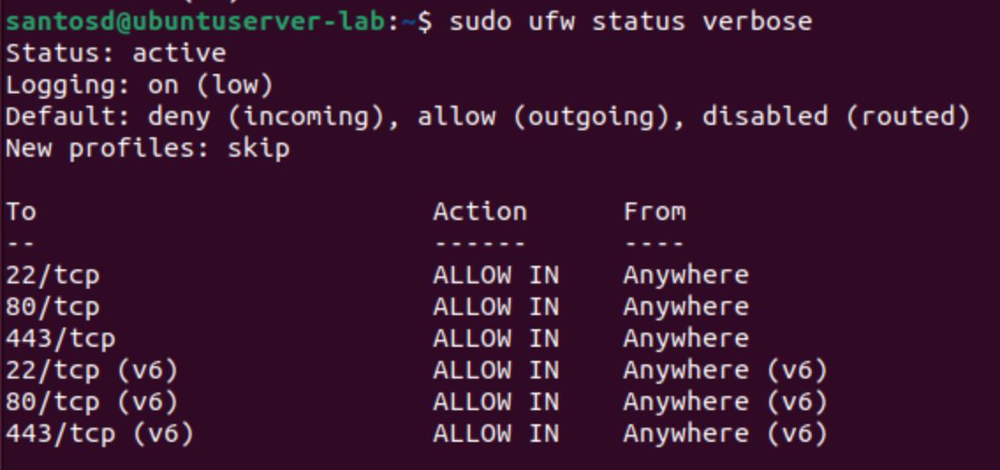

# Network Security with UFW  

In this lab I learned how to configure the Uncomplicated Firewall (UFW) on Ubuntu, check ports and services, and enable logging.   

---

## Part I Enable UFW  

### 1. Check UFW status  
**Command**:  
```bash
sudo ufw status
```  
Checks if UFW is installed and running. By default it’s often inactive.   

---

### 2. Allow SSH before enabling  
**Command**:  
```bash
sudo ufw allow 22/tcp
```  
This opens port 22 for SSH. If you enable the firewall without this, you could lock yourself out of the VM.  
**Answer**: It’s important because if you are connected remotely, blocking port 22 would cut off your SSH session.  

---

### 3. Check open ports  
**Command**:  
```bash
sudo ss -tuln
```  
Lists TCP/UDP sockets that are open and listening. Shows addresses and ports.  
If unsure about a port:  
```bash
sudo lsof -i :PORT
```  
This tells which service is using that port.   

---

### 4. Enable UFW  
**Command**:  
```bash
sudo ufw enable
```  
Activates the firewall.   

---

### 5. Check UFW status again  
**Command**:  
```bash
sudo ufw status
```  
Confirms the firewall is running and which rules are active.   

---

### 6. Web server ports  
For a web server, ports **80 (HTTP)** and **443 (HTTPS)** should be allowed.  
**Commands**:  
```bash
sudo ufw allow 80/tcp
sudo ufw allow 443/tcp
```   

---

### 7. Verbose status  
**Command**:  
```bash
sudo ufw status verbose
```  
Shows rules plus default policies (incoming = deny, outgoing = allow). Useful to confirm defaults.    

---

### 8. Block an IP address  
**Command**:  
```bash
sudo ufw deny from 10.0.0.0
```  
Blocks traffic from this IP (example: a disgruntled ex-employee).  

---

### 9. Allow host access to port 587  
**Command**:  
```bash
sudo ufw allow from 192.168.1.50 to any port 587
```  
Port 587 is typically used for sending email (SMTP submission).   
t
---

### 10. Confirm rules  
**Command**:  
```bash
sudo ufw status numbered
```  
Shows rules with numbers so they can be managed or deleted.   

---

## Part II UFW Logging  

### 1. Enable logging  
**Command**:  
```bash
sudo ufw logging on
```  
Turns on firewall logging.   

---

### 2. Set logging level to high  
**Command**:  
```bash
sudo ufw logging high
```  
Logs all blocked packets with connection details.   

---

### 3. Example log entry breakdown  
A blocked packet log shows MAC, source IP, destination IP, source port, destination port, and protocol.  
**Why useful?** It helps identify where unwanted traffic is coming from and what it was targeting.  

---

### 4. View logs live  
**Command**:  
```bash
sudo tail -f /var/log/ufw.log
```  
Shows UFW logs in real time. The `-f` keeps it updating.   

---

### 5. Filter DENY and ALLOW  
**Commands**:  
```bash
sudo grep 'DENY' /var/log/ufw.log
sudo grep 'ALLOW' /var/log/ufw.log
```  
Lets me see just blocked or allowed traffic.  
**Answer**: If DENY shows no output, it means no traffic has been blocked yet.  
