# Network Security with Snort

In this lab, I installed and configured Snort an IDS on Ubuntu. The goal was to understand how Snort monitors network traffic, detects suspicious activity, and logs alerts for analysis.

---

## 1. Update the System  

**Command:**  
```bash
sudo apt update && sudo apt upgrade -y
```

This ensures all system packages are up to date before installing Snort.
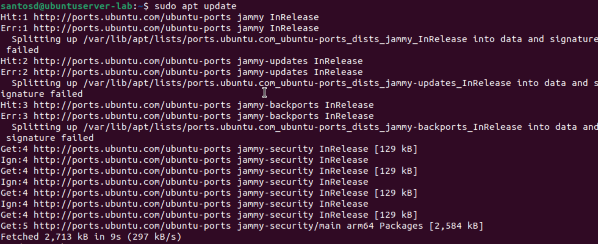
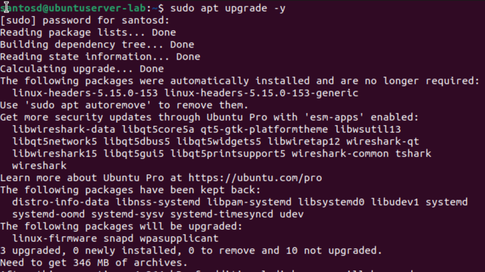
---

## 2. Install Snort

**Command:**

```bash
sudo apt install snort -y
```

During setup, you will be prompted for:

* **Network Interface:** `ens160` (check with `ip a`)
* **HOME_NET:** `any`

You can verify your interface:

```bash
ip a
```

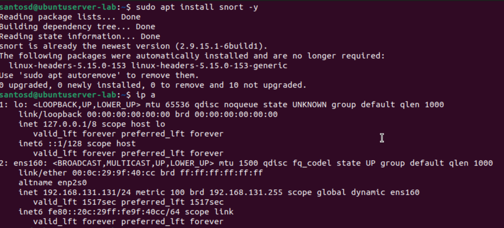
---

## 3. Configure Snort

**Command:**

```bash
sudo nano /etc/snort/snort.conf
```

Locate and modify the `HOME_NET` variable to match your network:

```bash
ipvar HOME_NET 192.168.131.131/24
```

This tells Snort what network range to treat as internal or trusted.
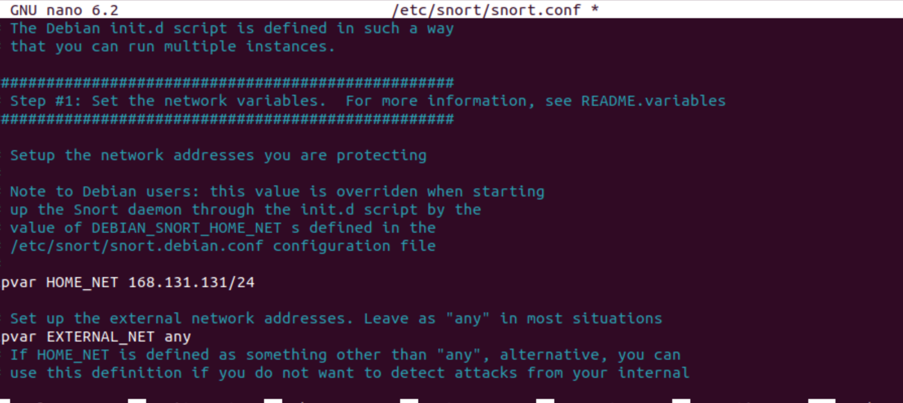

---

## 4. Update and Manage Rules

**Commands:**

```bash
sudo wget https://www.snort.org/downloads/community/community-rules.tar.gz
sudo tar -xvzf community-rules.tar.gz
sudo cp community-rules/* /etc/snort/rules/
```

Community rules expand Snort’s detection coverage.

Add a local custom rule:

```bash
sudo nano /etc/snort/rules/local.rules
```

Then add this rule:

```bash
alert icmp any any -> any any (msg:"ICMP detected"; sid:1000001; rev:1;)
```

This rule alerts whenever ICMP traffic (pings) is detected.
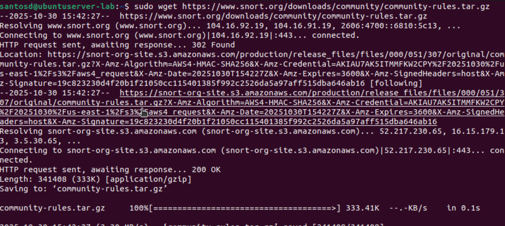
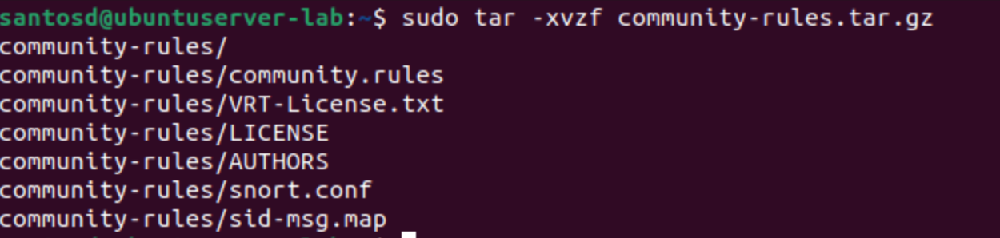

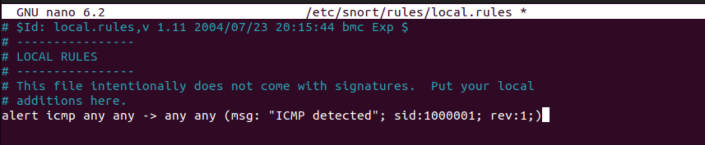
---

## 5. Test Snort Configuration

**Command:**

```bash
sudo snort -T -c /etc/snort/snort.conf
```

If successful, you’ll see:

```
Snort successfully validated the configuration!
```

This verifies that Snort and its rules are configured correctly.
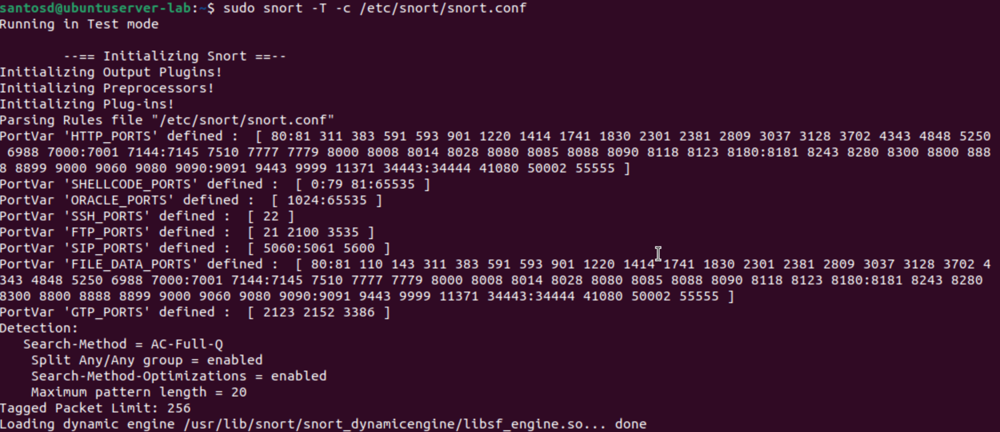
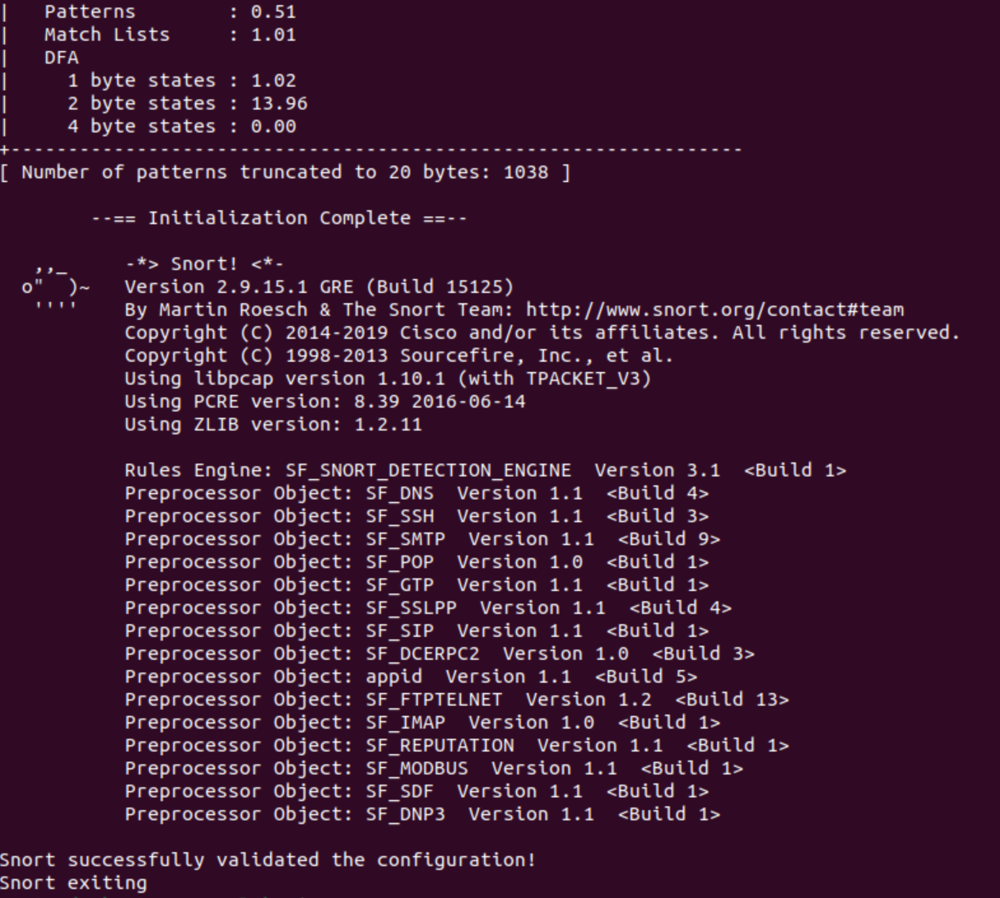
---

## 6. Run Snort in IDS Mode

**Command:**

```bash
sudo snort -c /etc/snort/snort.conf -i ens160
```

Snort now monitors traffic on the interface and logs alerts.
Stop monitoring with **Ctrl + C** when finished.
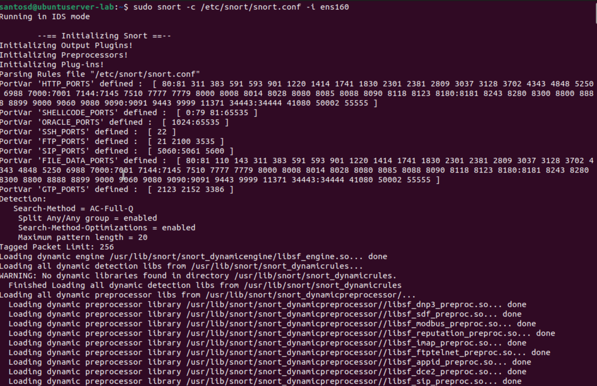
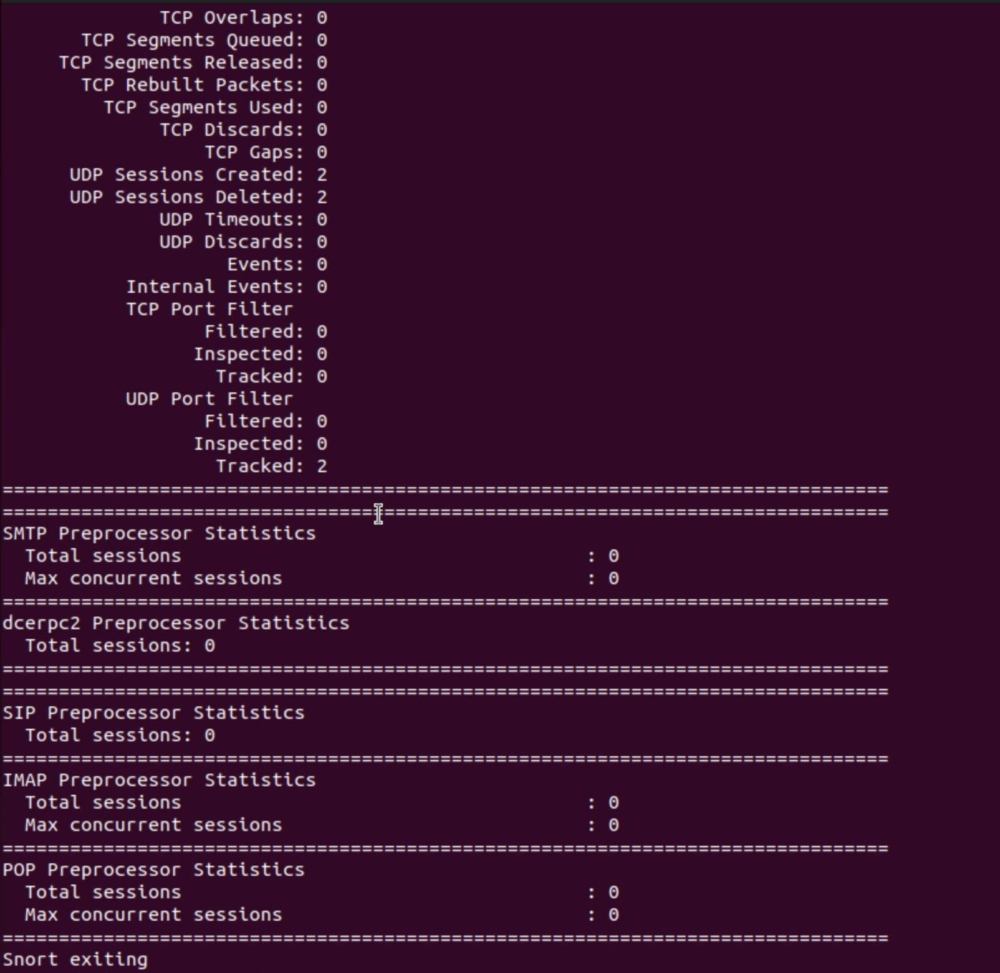
---

## 7. View Snort Logs

**Commands:**

```bash
cd /var/log/snort
ls -l
```

This directory stores log and alert files.
If empty, no traffic has triggered a rule yet.

The files with content showed Snort alerts triggered by network activity that matched detection rules.
The empty ones appeared because no alerts were generated during that monitoring session or because Snort had rotated and compressed older logs.
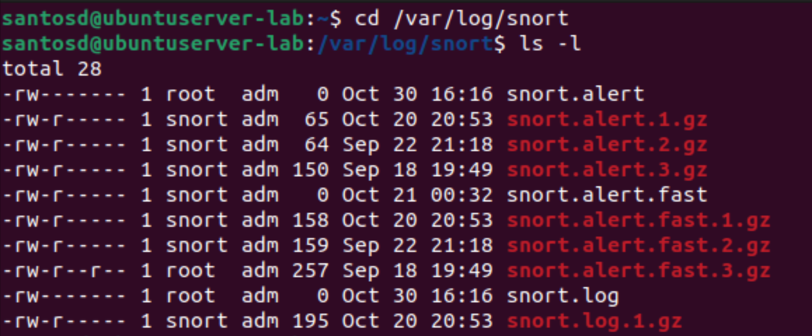
---

## 8. Run Snort as a Daemon

**Command:**

```bash
sudo snort -D -c /etc/snort/snort.conf -i enX0
```

Runs Snort in the background to continuously monitor the network.

Check if Snort is running:

```bash
top
```

Terminate the process:

```bash
sudo pkill snort
```

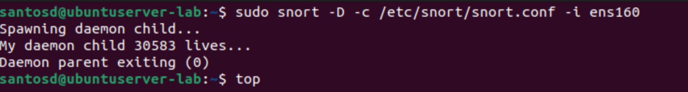
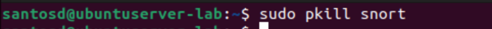

---


